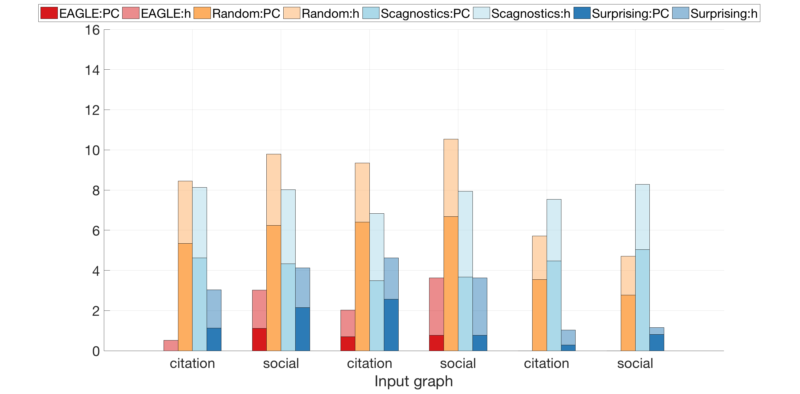

# Exploratory Analysis of Graph Data by Leveraging Domain Knowledge

**This is the code repository for the paper: [Exploratory Analysis of Graph Data by Leveraging Domain Knowledge](http://web.eecs.umich.edu/~dkoutra/papers/17_EAGLE_ICDM.pdf)**

By [Di Jin](http://www-personal.umich.edu/~dijin/), [Danai Koutra](http://web.eecs.umich.edu/~dkoutra/).

"Summarize an unknown graph from known ones."

## Table of Contents
- [DATA](#DATA)
- [analysis](#analysis)
- [extra_Features](#extra_Features)
- [lib](#lib)
- [processed](#processed)
- [records](#records)
- [src](#src)


## DATA
The data directory contains "real_train", the directory containing raw files of the domain knowledge (known graphs) and "real_test", the directory containing the input unknown graph file.

## analysis
The directory with experiments conducted in the paper. To run the experiments, run "exp_effectiveness", "exp_scalability_1", "exp_scalability_2" and "exp_sensitivity". For example, the evaluation of the diversity and domain-specificity of the graph invariant distributions selected by EAGLE and the baselines is conducted with the command
```shell
$ exp_effectiveness
``` 

The supplementary results of `Satisfaction of Desired Properties` (Section V, part D) from the paper can be obtained by running the same script with different correlation metrics. To be specific, here is the result running with 

## extra_Features
The directory contains the extra graph invariants computed through

## src

This code is built in MATLAB 2016a. The preprocessing procedure is time-consuming, the command to run without preprocessing the raw data files is:
```shell
$ main
``` 

## lib

- matlab_bgl: This library is adopted from the Internet written by David Gleich (https://www.cs.purdue.edu/homes/dgleich/packages/matlab_bgl/).
- util: This library contains several toolkits used in this project.
